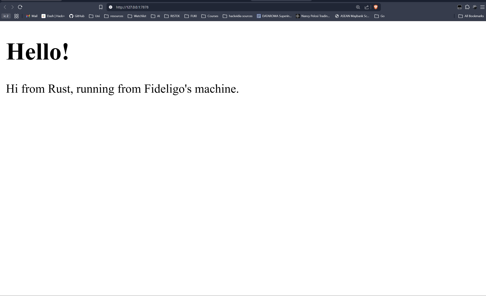
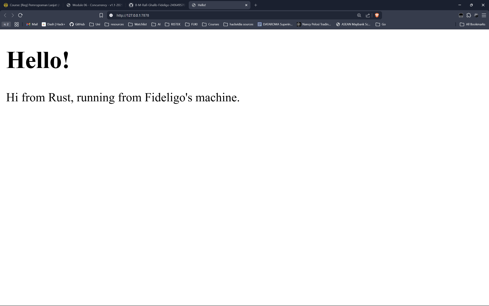
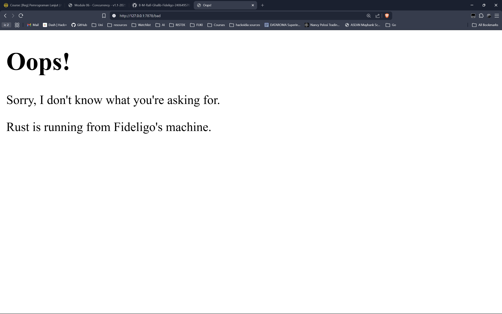
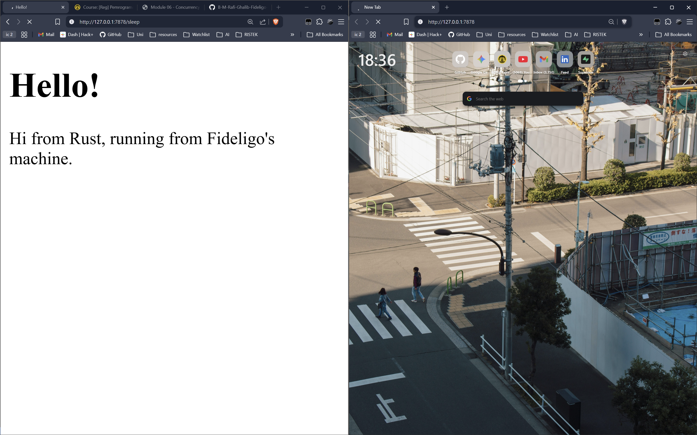
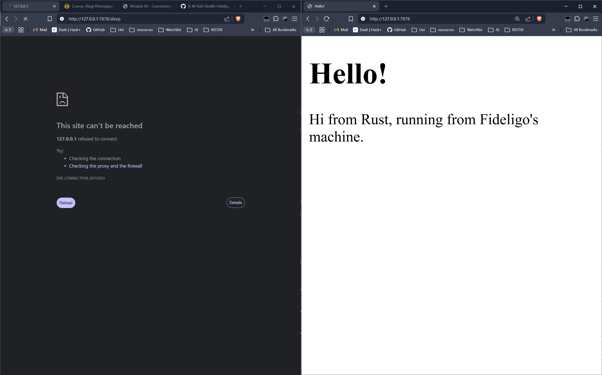

# Modul-6-Concurrency

# Commit 1 Reflection Notes

Di dalam fungsi handle_connection , kita menggunakan BufReader untuk membungkus TcpStream agar pembacaan data dari aliran koneksi menjadi lebih efisien. Request HTTP yang masuk kemudian dibaca baris per baris menggunakan method .lines().
Karena aturan format header HTTP selalu diakhiri dengan baris kosong, kita menggunakan .take_while(|line| !line.is_empty()) agar program tahu kapan harus berhenti membaca.
Terakhir, semua baris header yang sudah dibaca tersebut dikumpulkan menjadi struktur data Vec menggunakan .collect() , lalu isinya di-print ke terminal agar kita bisa melihat detail request yang dikirimkan oleh browser.

# Commit 2 Reflection Notes

Pada milestone ini, fungsi handle_connection dimodifikasi agar dapat mengirimkan respons HTTP yang valid ke browser, bukan hanya mencetak request ke terminal.

Perubahan utama yang dilakukan:
1. Menambahkan modul s dari standard library untuk membaca file dari disk.
2. Membaca isi file hello.html menggunakan s::read_to_string("hello.html").unwrap().
3. Menyusun respons HTTP lengkap dengan format yang benar: status line (HTTP/1.1 200 OK), header Content-Length yang berisi panjang konten, dua baris CRLF sebagai pemisah antara header dan body, lalu isi HTML-nya.
4. Mengirimkan respons tersebut ke browser menggunakan stream.write_all(response.as_bytes()).unwrap().

Header Content-Length penting agar browser tahu berapa byte yang harus dibaca dari response body. Tanpa header ini, browser mungkin tidak menampilkan halaman dengan benar. Format HTTP response harus mengikuti standar: setiap header dipisahkan oleh CRLF (\r\n), dan ada satu baris kosong (dua CRLF) antara header dan body.

# Commit 3 Reflection Notes

Pada milestone ini, server diperbarui agar dapat membedakan request yang valid dan tidak valid, lalu merespons secara selektif.

Perubahan utama yang dilakukan:
1. Hanya membaca baris pertama dari request HTTP (
equest_line) menggunakan .lines().next().unwrap().unwrap(), karena kita hanya perlu tahu path yang diminta.
2. Menggunakan if/else untuk mengecek isi 
equest_line:
   - Jika requestnya adalah GET / HTTP/1.1, server merespons dengan status 200 OK dan mengirim hello.html.
   - Untuk semua request lainnya, server merespons dengan status 404 NOT FOUND dan mengirim 404.html.
3. Menggunakan tuple (status_line, filename) agar logika pemilihan respons terpisah dari logika pengiriman respons — ini adalah bentuk refactoring sederhana yang membuat kode lebih bersih dan mudah dibaca.

Pemisahan ini penting karena pada server production, logika routing dan pengiriman respons sebaiknya tidak digabung. Dengan pola tuple ini, kode pengiriman hanya ditulis sekali dan dapat digunakan ulang untuk berbagai macam respons.

# Commit 4 Reflection Notes

Pada milestone ini, kita mensimulasikan masalah nyata dari server yang berjalan di single thread.

Perubahan yang dilakukan:
1. Menambahkan 	hread dan 	ime::Duration dari standard library.
2. Menambahkan route baru GET /sleep HTTP/1.1 yang memanggil 	hread::sleep(Duration::from_secs(10)) sebelum merespons.

Masalah yang terlihat:
Ketika kita membuka dua tab browser — satu ke 127.0.0.1:7878/sleep dan satu ke 127.0.0.1:7878 — tab kedua harus menunggu sampai tab pertama selesai (10 detik) baru bisa mendapatkan respons. Ini karena server kita hanya memiliki satu thread, sehingga setiap request diproses secara bergantian (sequential), bukan bersamaan (concurrent).

Inilah alasan mengapa server production tidak boleh single-threaded: satu request yang lambat akan memblokir semua request lainnya dan membuat semua pengguna menunggu.

# Commit 5 Reflection Notes

Pada milestone ini, server diubah dari single-threaded menjadi multithreaded menggunakan ThreadPool yang diimplementasikan secara manual.

Komponen yang dibuat dalam src/lib.rs:

1. **ThreadPool struct** — menyimpan daftar Worker dan sebuah sender channel (mpsc). Saat execute() dipanggil, job dikirim melalui channel ke salah satu worker yang tersedia.

2. **Worker struct** — setiap worker memiliki ID dan sebuah thread yang berjalan dalam loop, menunggu job dari receiver channel. Worker menggunakan Arc<Mutex<Receiver>> agar receiver bisa dibagikan dengan aman ke banyak thread sekaligus.

3. **Drop implementation** — saat ThreadPool di-drop, sender channel ditutup terlebih dahulu (agar semua worker menerima signal disconnect), lalu setiap worker thread di-join agar program tidak exit sebelum semua job selesai.

Cara kerjanya:
- ThreadPool::new(4) membuat 4 worker thread yang siap menerima job.
- pool.execute(|| { handle_connection(stream); }) mengirim setiap koneksi masuk sebagai job ke thread pool.
- Karena ada 4 thread, server kini bisa menangani hingga 4 koneksi secara bersamaan.
- Sekarang jika membuka /sleep di satu tab, tab lain tetap bisa diakses tanpa menunggu.

# Commit Bonus Reflection Notes

Pada bagian bonus, ditambahkan fungsi uild() sebagai alternatif yang lebih aman dari 
ew().

Perbedaan antara 
ew() dan uild():

| Aspek | 
ew() | uild() |
|---|---|---|
| Return type | ThreadPool | Result<ThreadPool, PoolCreationError> |
| Jika size = 0 | Panic (ssert!(size > 0)) | Return Err(PoolCreationError) |
| Error handling | Tidak bisa di-handle oleh caller | Bisa di-handle dengan unwrap_or_else, match, ? operator, dll |
| Idiom Rust | Umum untuk constructors sederhana | Lebih idiomatic untuk operasi yang bisa gagal |

Mengapa uild() lebih baik?
- Dalam Rust, fungsi yang berpotensi gagal sebaiknya mengembalikan Result bukan langsung panic. Ini memungkinkan caller untuk memutuskan sendiri apa yang harus dilakukan saat terjadi error — apakah retry, log error, atau exit dengan pesan yang informatif.
- 
ew() cocok untuk kasus di mana input invaliddianggap programming error (bug), sedangkan uild() cocok untuk kasus di mana input invalid bisa datang dari luar (misalnya config file atau user input).
- Di main.rs, penggunaan unwrap_or_else memungkinkan kita mencetak pesan error yang jelas dan exit secara graceful, bukan crash dengan pesan panic yang membingungkan.
